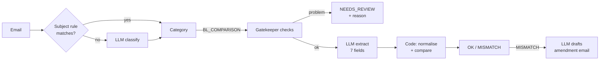
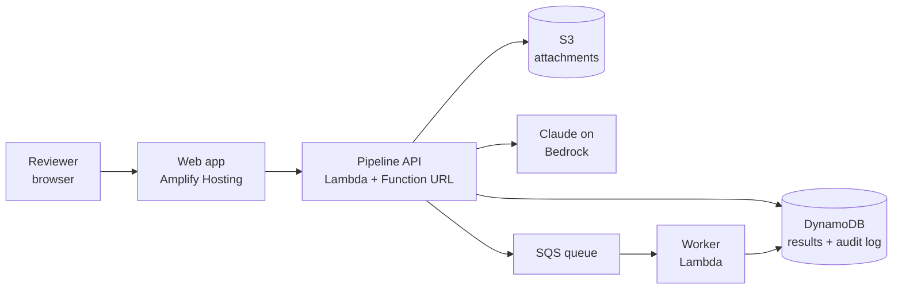

# SDOC Build Plan

As of 20 Sep 2026. Tick items off in the backlog as we go.

## TL;DR

We build a **web app** for Averis's shipping-document team. It reads the inbox, sorts every email, checks each draft Bill of Lading (BL) against its Shipping Instruction (SI), and shows a reviewer exactly which fields are wrong.

- **What it is:** a deployed website (reviewer dashboard) on top of a cloud API that runs the AI pipeline.
- **Where AI goes:** reading messy emails and documents. **Where plain code goes:** the actual field comparison, so it's exact and testable.
- **The hook:** it never guesses. Unclear cases go to a human with a reason, and every mismatch comes with a drafted amendment email.
- **Cloud:** AWS Free Plan. Lambda + DynamoDB + SQS (always free), S3 + Amplify + Claude on Bedrock (paid from the $200 new-account credits). Expected spend: $0 out of pocket.
- **Deadline:** preliminary submission Tue 22 Sep, 12:00 PM.

## Non-negotiables

Whatever idea we pick, it must do all of these. Missing any one costs marks or gets us disqualified.

| Must have | Why | Source |
| --- | --- | --- |
| Classify all 520 emails into the 5 categories | 30% of the automated score | Scorer |
| Extract the 7 fields from SI and BL in txt, PDF, DOCX and XLSX | Needed for any comparison | Dataset README |
| Name the **exact** set of mismatched fields | 50% of the automated score (end-to-end) | Scorer |
| Return NEEDS_REVIEW with a reason instead of guessing | Reliability axis; false alarms hurt | Scorer, README |
| Output a `submission.json` in the sample format | How the scorer reads us | Participant README |
| AI as a key component | Required | Rules |
| Runs on cloud infrastructure | "Significantly reduced scores" without it | Rules |
| Public live demo link that stays up | Mandatory deliverable | Rules |
| Works end-to-end, not mock-ups | 25 of 100 judge marks | Rubric |
| Public GitHub repo with setup README | Mandatory deliverable | Rules |
| Demo video of 5 minutes or less | −1 mark per 30 s over | Rules |
| Slides: architecture, implementation, challenges, roadmap | Mandatory deliverable | Rules |
| Our own measured results (hand-labelled test set) | "Validation" (15) and "Impact: metrics" in the video | Rubric, Rules |

## App, website or something else?

**Build a web app.** Judges need a public link they can open, and Averis's document staff work at desks in Outlook, not on phones.

| Option | Verdict | Reason |
| --- | --- | --- |
| Web app (dashboard + API) | **Build this** | Public link for judges, works on any laptop, fastest to build and demo |
| Mobile app | Skip | Nobody checks a Bill of Lading on a phone; app-store setup wastes days |
| Script / CLI only | Skip as the product | A script-only entry scores poorly on UX; keep the script for making `submission.json` |
| Outlook add-in | Roadmap slide | Where the users actually work; good "future potential" story for the finals |
| Chatbot | Skip | The job is a queue of checks, not a conversation |

The web app has three screens:

1. **Inbox:** every email with its category and a status chip (OK, MISMATCH, NEEDS_REVIEW).
2. **Compare view:** SI and BL side by side, wrong fields highlighted, the source line for each value, and Approve / Override buttons.
3. **Draft reply:** the amendment email to the carrier, ready to edit and send.

## How we use AI

AI reads; code decides. The LLM turns messy emails and documents into clean structured data, and plain code does the comparison, so the result is exact and we can test it.

| Step | Who does it | How |
| --- | --- | --- |
| Classify | Rules first, AI fallback | Regex on subject codes (`TO CONFIRM DOCS`, `SI -`, `CANCEL INVOICE`). Only unmatched emails go to a small, cheap model (Claude Haiku 4.5 on Bedrock), with signatures and forwarded threads stripped. Log `decided_by: rule` or `llm`. |
| Read files | Code | `pdfplumber`, `python-docx`, `openpyxl`. No text layer, 0-byte or corrupt file → `unreadable`. |
| Gatekeeper | Code + AI | Code: no BL attached, placeholders (`???`, `TBA`, `____`). AI: "is this second file really a BL, or an invoice / packing list?" |
| Extract | AI | Claude Haiku 4.5 on Bedrock with a strict JSON schema (retry low-confidence fields with Sonnet 5): for each of the 7 fields, the value, the exact source line, and a confidence. This handles the label synonyms (`POD` = `Discharge Port`). |
| Compare | Code | Ports by UN/LOCODE (`MYPKG`), containers to a count, weights to whole kg, company names case- and punctuation-insensitive. Low extraction confidence → NEEDS_REVIEW. |
| Draft reply | AI | For each MISMATCH, write the amendment request to the carrier. A person approves before sending. |

**Why this split wins marks:** the rubric rewards "technology integration" and "robustness". An LLM deciding matches can hallucinate. Code deciding matches is testable, and we can show the tests.

## Cloud architecture

**AWS Free Plan, built so we pay $0.** New accounts get $100 in credits, plus $100 more for five 20-minute onboarding tasks. A Free Plan account closes instead of billing when credits run out, so there are no surprise charges.

| Piece | Service | Cost |
| --- | --- | --- |
| Web app | Amplify Hosting (static React build) | Cents, from credits |
| Pipeline API | Lambda (Python) + Function URL | Always free: 1M requests/month; Function URLs cost nothing |
| Database | DynamoDB | Always free: 25 GB |
| Queue + worker | SQS + a second Lambda | Always free: 1M requests/month |
| File store | S3 | Cents for ~10 MB, from credits |
| AI | Claude Haiku 4.5 on Bedrock; Sonnet 5 only for retries | About $1 per full 520-email run; from credits |
| Secrets | None needed: Lambda calls Bedrock with its IAM role | $0 |

**Budget rules**

- Day one: do the five credit tasks (EC2, RDS, Lambda, Bedrock prompt, Budget) to reach $200, then **delete the EC2 and RDS instances**.
- Set an AWS Budget alert at $10.
- Check that Bedrock charges show under "Amazon Bedrock" in Billing, not "AWS Marketplace". Credits don't cover Marketplace charges.
- Apart from the credit tasks, never create a NAT Gateway, EC2 server, RDS database or OpenSearch. These are the usual surprise bills.
- Use Haiku by default and cache results in DynamoDB, so a rerun only calls the AI for emails that changed.
- One team account; give each teammate an IAM user, not the root login.

## Product backlog

Everything marked Must is needed for the 22 Sep preliminary submission. Should items are what make us stand out; Finals items wait until after 24 Sep.

| Done | Epic | Priority | Earns marks on |
| --- | --- | --- | --- |
| [ ] | Hand-label a 40-email test set (mix of categories and formats) | Must | Validation, impact metrics |
| [ ] | Load emails; subject-code rules for classification | Must | Stage 1 score (30%) |
| [ ] | LLM fallback classifier for emails rules can't place | Must | Stage 1, AI requirement |
| [ ] | File readers: txt, PDF, DOCX, XLSX | Must | Working prototype |
| [ ] | LLM extraction of the 7 fields (JSON schema, source line, confidence) | Must | Tech integration |
| [ ] | Normalise + compare fields in code | Must | End-to-end (50%) |
| [ ] | Gatekeeper: 4 NEEDS_REVIEW reasons | Must | Reliability, robustness |
| [ ] | Generate submission.json; score against our test set | Must | Validation |
| [ ] | Deploy API to Lambda (Function URL) + DynamoDB | Must | Cloud requirement |
| [ ] | Web dashboard: inbox + side-by-side compare view | Must | Working prototype, UX |
| [ ] | Submission pack: README, slides, 5-min video, form | Must | Mandatory |
| [ ] | Drafted amendment email for each MISMATCH | Should | Differentiation, user value |
| [ ] | Audit trail: decided_by, source lines, reviewer decisions | Should | Engineering quality |
| [ ] | Unit tests for normaliser and comparer | Should | Engineering quality |
| [ ] | Impact panel: accuracy, false alarms, minutes saved | Should | Impact |
| [ ] | Live Gmail/Outlook mailbox connection | Finals | End-to-end (finals) |
| [ ] | SQS worker for parallel batch processing | Finals | Architecture & scalability |
| [ ] | Learn from reviewer corrections (new label synonyms) | Finals | Future potential |
| [ ] | Outlook add-in | Could | Roadmap slide |

## Who does what, and when

Split into four roles so nobody waits on anyone. With fewer than four people, one person takes two roles, and the pitch role merges into whoever finishes first.

| Role | Owns | First deliverable |
| --- | --- | --- |
| Pipeline | Classify, extract, compare, gatekeeper | `submission.json` for all 520 emails |
| Backend + cloud | Lambda, DynamoDB, S3, Bedrock access, budget alert | Public API URL |
| Frontend | Inbox, compare view, draft reply | Dashboard reading the API |
| Quality + pitch | Test set, scoring script, slides, video | 40 labelled emails, then our accuracy numbers |

| When | Goal |
| --- | --- |
| Sun 20 Sep (today) | Test set labelled; rules classifier + file readers + extraction running locally. Workshop 1 at 12 PM. |
| Mon 21 Sep | Compare + gatekeeper done; API deployed; dashboard shows real results. Workshop 2 (Averis) at 7 PM: ask what matters most. |
| Tue 22 Sep, by 10 AM | Drafted replies, measured results, README, slides, video recorded. |
| Tue 22 Sep, 12:00 PM | **Submit.** Aim to send the form by 11:00 AM. |

**Open questions**
- Who creates the team AWS account? It needs a card on file even on the Free Plan. Do it today, because deployment blocks the live demo link.
- Does Bedrock give our new account access to Claude Haiku 4.5 in a region near us? Test one prompt on day one (it's also a credit task).
