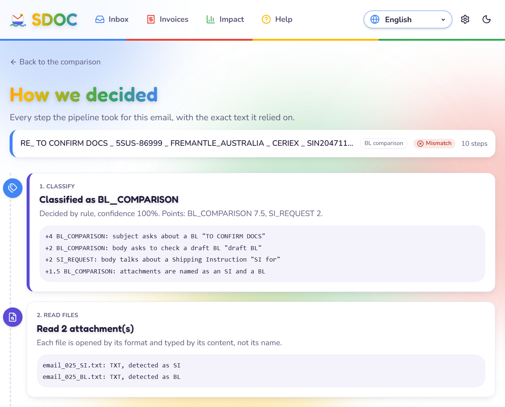
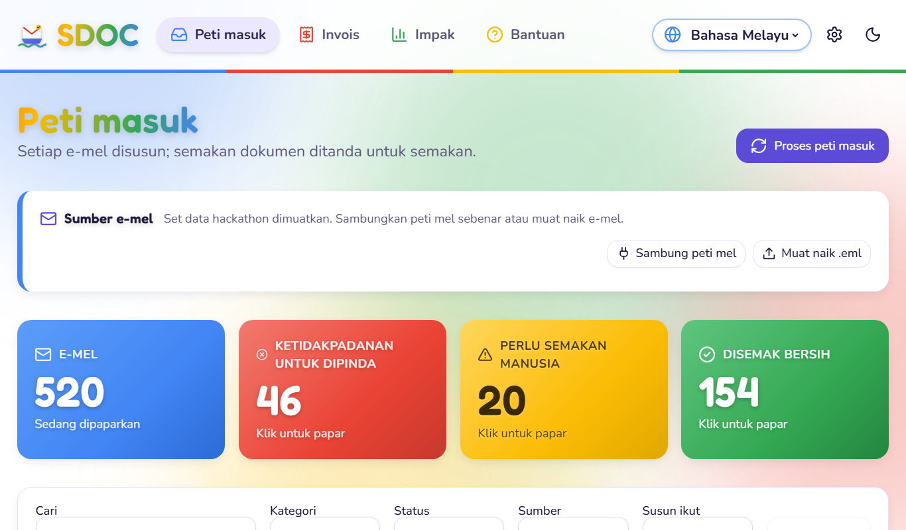
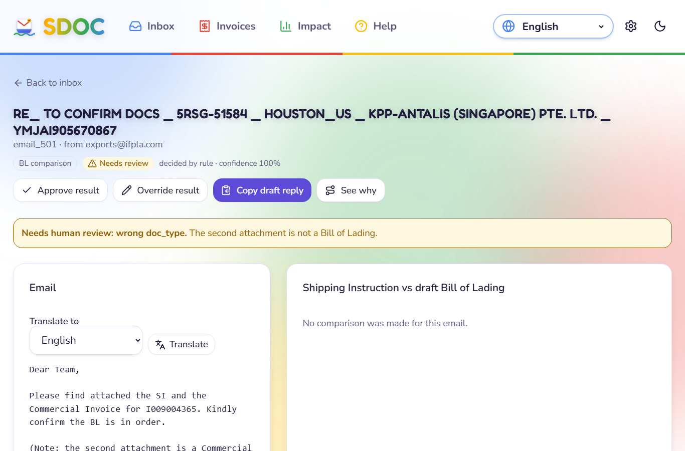
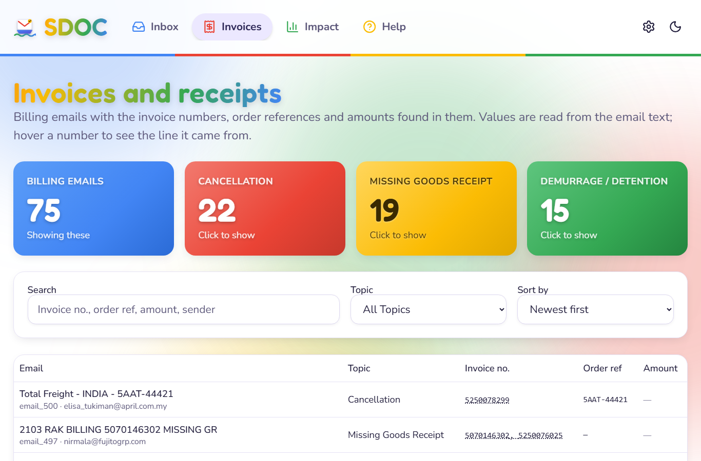
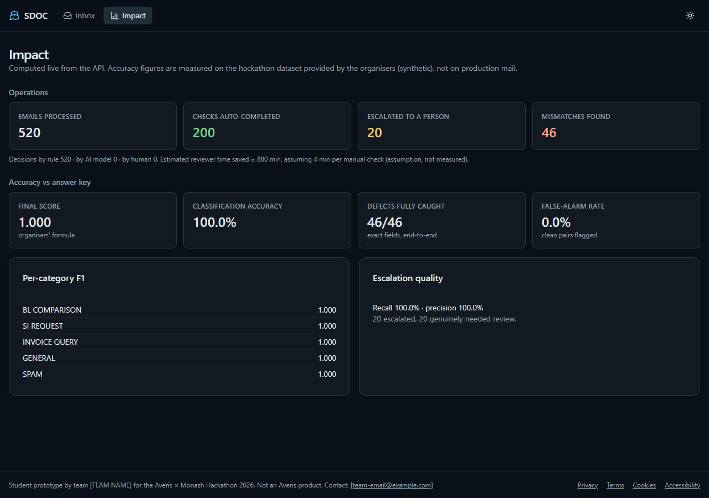
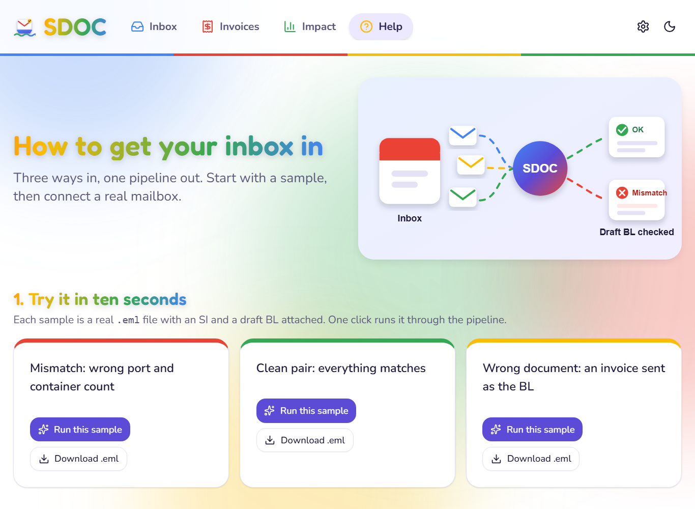
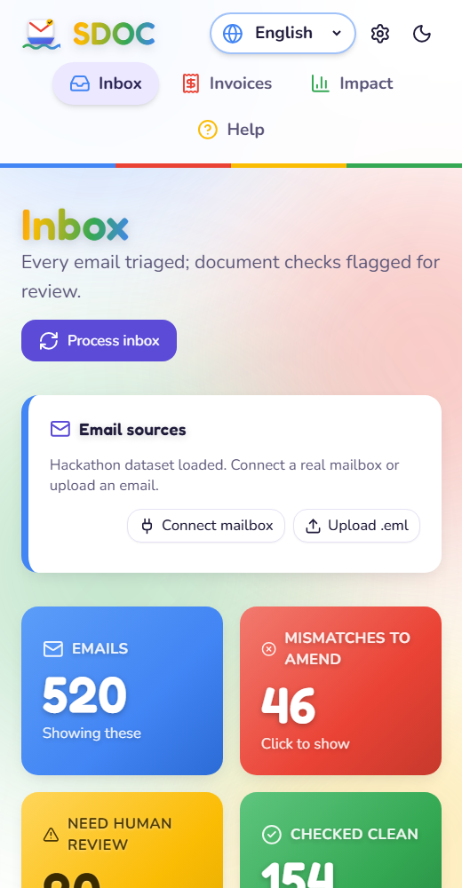

# SHIPDOC - Shipping Document Check

**Team Claude's Plan** · Averis × Monash Hackathon 2026

shipdoc reads a shipping-documentation inbox, sorts every email, checks each draft Bill of Lading (BL) against its Shipping Instruction (SI), and hands anything it cannot decide to a person with the reason. It runs as a website and an Android app on top of one Python pipeline.


## Try it out at https://shipdoc.org

Documentation at:  https://docs.shipdoc.org


| Artifact | Link |
|---|---|
| **Demo video (5 min)** | https://youtu.be/6k3d8YqbmIU |
| **Backend API** | https://j2mwf375qvy2xpf3xdqs4wai6y0rvrqd.lambda-url.ap-southeast-1.on.aws/docs |
| **Android app** | [apk/sdoc-debug.apk](apk/sdoc-debug.apk) · [how to run it](docs/DEMO-ANDROID.md) |


Deployed on AWS in ap-southeast-1: Lambda + Function URL, DynamoDB, Amplify Hosting.

## Results on the 520-email dataset

Rules and heuristics only, no AI calls. Reproduce with `sdoc run`.

| Metric | Result |
|---|---|
| Final score (organisers' formula: 0.30 classify + 0.20 defect-F1 + 0.50 end-to-end) | **1.000** |
| Classification accuracy, 5 categories | 100 % |
| Defective BLs caught with the exact wrong fields | 46 / 46 |
| False alarms on clean pairs | 0 |
| Cases escalated to a person with the right reason | 20 / 20 |
| Automated tests | 59 passing (`pytest`) |

The dataset is synthetic, provided by the organisers. The AI layer is what carries the system to messier real mail.

## Features

### Required by the challenge

| Feature | Where |
|---|---|
| Sort every email into BL comparison, SI request, invoice query, general or spam | `sdoc/classify.py` |
| Read SI and BL attachments in `.txt`, `.pdf`, `.docx` and `.xlsx` | `sdoc/readers.py` |
| Find the 7 fields whatever they are labelled (*POD* = *Discharge Port*, *To the Order of* = *Consignee*) | `sdoc/extract.py` |
| Compare them and name the exact fields that differ | `sdoc/compare.py` |
| Escalate instead of guessing: missing attachment, unreadable file, wrong document type, blank value | `sdoc/gate.py` |
| Scorer-ready `submission.json` for all 520 emails | `sdoc run` |
| AI as a key component: Gemini, Claude API or Amazon Bedrock for classification fallback, field extraction and translation | `sdoc/llm.py` |
| Cloud deployment path on AWS Free Plan (Lambda, DynamoDB, S3, Amplify, Bedrock) | `docs/PLAN.md`, `docs/HANDOFF.md` |

### Trust and explainability

| Feature | Where |
|---|---|
| **Why?** page for every email: the words that classified it and their points, each safety check, what each file was detected as, the line every value came from, and the compared values | Inbox → *Why?* |
| Evidence on hover: every SI and BL value shows its source line | Compare screen |
| The comparison is plain, tested code; AI never decides a match | `sdoc/compare.py` |
| Reviewer **Approve** / **Override** with an audit trail of who decided | Compare screen |
| Live accuracy against the answer key, labelled as synthetic-data results | Impact page |



### Getting email in

| Feature | Where |
|---|---|
| Connect a real mailbox over read-only IMAP: Gmail (App Password), Outlook / Microsoft 365, Yahoo, any IMAP host | Inbox → *Connect mailbox* |
| *Fetch new mail* and *Disconnect*; credentials held in memory only | Inbox |
| Upload one or many `.eml` files | Inbox → *Upload .eml* |
| Three one-click sample emails and a step-by-step Gmail guide | Help page |
| 13 ready-made test emails covering every case, each verified | `docs/test-emails/` |

### Convenience

| Feature | Where |
|---|---|
| Drafted amendment email for every mismatch, and a resend request for escalations; copy in one click | Compare screen |
| Click a KPI tile (e.g. *46 mismatches*) to filter the list and scroll to it | Inbox |
| Search, plus separate Category, Status, Source and Sort filters, a live result count and Clear | Inbox |
| **Invoices** page: invoice numbers, order refs and amounts pulled from billing emails, filter by topic | Invoices |
| Translate any email into 10 languages with AI | Compare → *Translate* |
| Change the API address in the app itself, so one build works on any laptop, phone or the cloud | Gear icon |

### UI / UX

| Feature | Where |
|---|---|
| Interface in **English, Bahasa Melayu and 中文**, switched from the globe in the header | Header |
| Light (Gmail white) and dark themes | Moon / sun icon |
| Google-colour status tiles, hover sheen on titles, cards that lift, drifting background colours | Whole site |
| Status always shown with text and an icon, never colour alone | Badges |
| Keyboard operable, skip link, visible focus, screen-reader labels, respects reduced motion | Whole site |
| Responsive: tabs move under the title on narrow screens | Header |



### Platforms and running it

| Feature | Where |
|---|---|
| Website (React, static build) | `web/` |
| Android app from the same code (Capacitor), prebuilt APK | `apk/sdoc-debug.apk` |
| One-command demo of the Android app on a laptop | `scripts/demo-android.ps1`, `docs/DEMO-ANDROID.md` |
| Docker: API and dashboard with one command | `docker compose up --build` |
| Command line: `sdoc run`, `score`, `inspect`, `serve` | `sdoc/cli.py` |

### Legal and privacy

| Feature | Where |
|---|---|
| Privacy Policy, Terms of Use, Cookie Policy, Accessibility statement | Footer links |
| No analytics, trackers, cookies or third-party scripts; fonts self-hosted | `docs/COMPLIANCE.md` |
| Consent checkboxes on the mailbox and override forms | Forms |
| Review against Malaysia's PDPA 2010 and other local law, with risks flagged | `docs/COMPLIANCE.md` |

## Screenshots

| Compare | Needs review |
|---|---|
|  |  |

| Invoices | Impact |
|---|---|
|  |  |

| Help | Phone width |
|---|---|
|  |  |

## Quick start

### With Docker

```bash
docker compose up --build
# dashboard http://localhost:5173   API http://localhost:8000/docs
```

### Without Docker

```bash
py -3.12 -m venv .venv
.venv\Scripts\activate                 # macOS/Linux: source .venv/bin/activate
pip install -e ".[dev]"
sdoc serve                             # API on http://127.0.0.1:8000

# second terminal
cd web
npm install
npm run dev                            # dashboard on http://localhost:5173
```

Open the dashboard and click **Process inbox**. Two optional files are not in the repo: `.env` (the Gemini key, see `.env.example`) and the organisers' `ground_truth.json` in `Provided Information/Other/data_v2/` (for the accuracy panel).

Other commands: `sdoc run` writes `output/submission.json` and prints the score, `sdoc inspect email_025` shows one email in full, and `pytest` runs the tests.

## How it works

```
email -> classify -> (BL comparison?) -> safety checks -> read SI + BL -> extract 7 fields -> compare -> OK / MISMATCH
          rules first,                    missing / unreadable /           rules first,        plain code,   + wrong fields
          AI fallback                     wrong type / blank value         AI fills gaps       no AI         + drafted reply
                                          -> NEEDS_REVIEW with reason
```

Each stage is one class behind an abstract base, wired together in `build_pipeline()`, so any stage can be swapped or tested alone. Details: [docs/ARCHITECTURE.md](docs/ARCHITECTURE.md).

## Repo layout

```
sdoc/        pipeline package (classify, readers, doctype, extract, compare, gate, pipeline, api, cli)
web/         React dashboard; web/android is the Capacitor Android project
tests/       pytest suite
docs/        plan, architecture, handoff, user guide, compliance, AWS deployment, test emails, screenshots
scripts/     Android demo launcher, test-email generator
apk/         prebuilt Android APK
Provided Information/Participant Info/   the hackathon dataset
```

## Documents

[Plan](docs/PLAN.md) · [Architecture](docs/ARCHITECTURE.md) · [Frontend/backend handoff](docs/HANDOFF.md) · [User guide](docs/USER-GUIDE.md) · [Android demo](docs/DEMO-ANDROID.md) · [Compliance](docs/COMPLIANCE.md) · [Test emails](docs/test-emails/)

Team Claude's Plan: Rahul Vedant Pemsing, Chew Ee Huan, Lye Wei Ho, Khoo Lip Hong, Syed Ibrahim Hassan.

Student prototype for the Averis × Monash Hackathon 2026. Not an Averis product.
