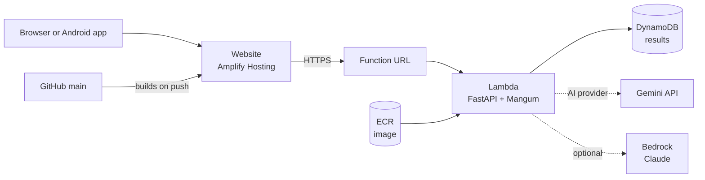
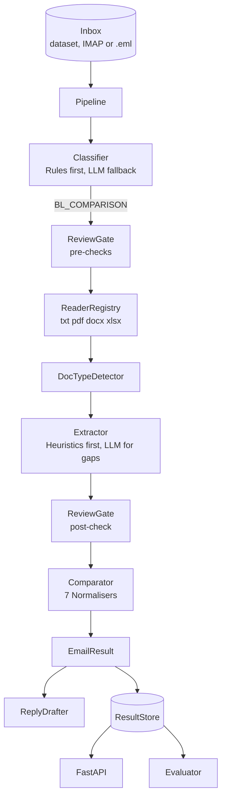

# SHIPDOC - Shipping Document Check

**Team Claude's Plan** · Averis × Monash Hackathon 2026

shipdoc reads a shipping-documentation inbox, sorts every email, checks each draft Bill of Lading (BL) against its Shipping Instruction (SI), and hands anything it cannot decide to a person with the reason. It runs as a website and an Android app on top of one Python pipeline.


## Try it out at https://shipdoc.org

Documentation at:  https://docs.shipdoc.org


| Artifact | Link |
|---|---|
| **Demo video (5 min)** | https://youtu.be/6k3d8YqbmIU |
| **Backend API** | https://j2mwf375qvy2xpf3xdqs4wai6y0rvrqd.lambda-url.ap-southeast-1.on.aws/docs |
| **Android app** | [apk/sdoc-debug.apk](apk/sdoc-debug.apk) · [how to run it](docs/DEMO-ANDROID.md) |
| **Slides** | https://canva.link/gv1ugztqn5bd2fc |
| **Written responses** | [Problem fit, AI and cloud, testing, challenges, metrics, scalability](#written-responses) |


Deployed on AWS in ap-southeast-1: Lambda + Function URL, DynamoDB, Amplify Hosting.

## Results on the 520-email dataset

Rules and heuristics only, no AI calls. Reproduce with `sdoc run`.

| Metric | Result |
|---|---|
| Final score (organisers' formula: 0.30 classify + 0.20 defect-F1 + 0.50 end-to-end) | **1.000** |
| Classification accuracy, 5 categories | 100 % |
| Defective BLs caught with the exact wrong fields | 46 / 46 |
| False alarms on clean pairs | 0 |
| Cases escalated to a person with the right reason | 20 / 20 |
| Automated tests | 59 passing (`pytest`) |

The dataset is synthetic, provided by the organisers. The AI layer is what carries the system to messier real mail.

## Features

### Required by the challenge

| Feature | Where |
|---|---|
| Sort every email into BL comparison, SI request, invoice query, general or spam | `sdoc/classify.py` |
| Read SI and BL attachments in `.txt`, `.pdf`, `.docx` and `.xlsx` | `sdoc/readers.py` |
| Find the 7 fields whatever they are labelled (*POD* = *Discharge Port*, *To the Order of* = *Consignee*) | `sdoc/extract.py` |
| Compare them and name the exact fields that differ | `sdoc/compare.py` |
| Escalate instead of guessing: missing attachment, unreadable file, wrong document type, blank value | `sdoc/gate.py` |
| Scorer-ready `submission.json` for all 520 emails | `sdoc run` |
| AI as a key component: Gemini, Claude API or Amazon Bedrock for classification fallback, field extraction and translation | `sdoc/llm.py` |
| Cloud deployment path on AWS Free Plan (Lambda, DynamoDB, S3, Amplify, Bedrock) | `docs/PLAN.md`, `docs/HANDOFF.md` |

### Trust and explainability

| Feature | Where |
|---|---|
| **Why?** page for every email: the words that classified it and their points, each safety check, what each file was detected as, the line every value came from, and the compared values | Inbox → *Why?* |
| Evidence on hover: every SI and BL value shows its source line | Compare screen |
| The comparison is plain, tested code; AI never decides a match | `sdoc/compare.py` |
| Reviewer **Approve** / **Override** with an audit trail of who decided | Compare screen |
| Live accuracy against the answer key, labelled as synthetic-data results | Impact page |


### Getting email in

| Feature | Where |
|---|---|
| Connect a real mailbox over read-only IMAP: Gmail (App Password), Outlook / Microsoft 365, Yahoo, any IMAP host | Inbox → *Connect mailbox* |
| *Fetch new mail* and *Disconnect*; credentials held in memory only | Inbox |
| Upload one or many `.eml` files | Inbox → *Upload .eml* |
| Three one-click sample emails and a step-by-step Gmail guide | Help page |
| 13 ready-made test emails covering every case, each verified | `docs/test-emails/` |

### Convenience

| Feature | Where |
|---|---|
| Drafted amendment email for every mismatch, and a resend request for escalations; copy in one click | Compare screen |
| Click a KPI tile (e.g. *46 mismatches*) to filter the list and scroll to it | Inbox |
| Search, plus separate Category, Status, Source and Sort filters, a live result count and Clear | Inbox |
| **Invoices** page: invoice numbers, order refs and amounts pulled from billing emails, filter by topic | Invoices |
| Translate any email into 10 languages with AI | Compare → *Translate* |
| Change the API address in the app itself, so one build works on any laptop, phone or the cloud | Gear icon |

### UI / UX

| Feature | Where |
|---|---|
| Interface in **English, Bahasa Melayu and 中文**, switched from the globe in the header | Header |
| Light (Gmail white) and dark themes | Moon / sun icon |
| Google-colour status tiles, hover sheen on titles, cards that lift, drifting background colours | Whole site |
| Status always shown with text and an icon, never colour alone | Badges |
| Keyboard operable, skip link, visible focus, screen-reader labels, respects reduced motion | Whole site |
| Responsive: tabs move under the title on narrow screens | Header |


### Platforms and running it

| Feature | Where |
|---|---|
| Website (React, static build) | `web/` |
| Android app from the same code (Capacitor), prebuilt APK | `apk/sdoc-debug.apk` |
| One-command demo of the Android app on a laptop | `scripts/demo-android.ps1`, `docs/DEMO-ANDROID.md` |
| Docker: API and dashboard with one command | `docker compose up --build` |
| Command line: `sdoc run`, `score`, `inspect`, `serve` | `sdoc/cli.py` |

### Legal and privacy

| Feature | Where |
|---|---|
| Privacy Policy, Terms of Use, Cookie Policy, Accessibility statement | Footer links |
| No analytics, trackers, cookies or third-party scripts; fonts self-hosted | `docs/COMPLIANCE.md` |
| Consent checkboxes on the mailbox and override forms | Forms |
| Review against Malaysia's PDPA 2010 and other local law, with risks flagged | `docs/COMPLIANCE.md` |

## Screenshots

| Compare | Needs review |
|---|---|
|  |  |

| Invoices | Impact |
|---|---|
|  |  |

| Help | Phone width |
|---|---|
|  |  |

## Quick start

### With Docker

```bash
docker compose up --build
# dashboard http://localhost:5173   API http://localhost:8000/docs
```

### Without Docker

```bash
py -3.12 -m venv .venv
.venv\Scripts\activate                 # macOS/Linux: source .venv/bin/activate
pip install -e ".[dev]"
sdoc serve                             # API on http://127.0.0.1:8000

# second terminal
cd web
npm install
npm run dev                            # dashboard on http://localhost:5173
```

Open the dashboard and click **Process inbox**. Two optional files are not in the repo: `.env` (the Gemini key, see `.env.example`) and the organisers' `ground_truth.json` in `Provided Information/Other/data_v2/` (for the accuracy panel).

Other commands: `sdoc run` writes `output/submission.json` and prints the score, `sdoc inspect email_025` shows one email in full, and `pytest` runs the tests.

## Written responses

The organisers' FAQ asks for six written responses. They are answered below, together with the documentation the submission form asks for. The same material, with screenshots, is on [docs.shipdoc.org](https://docs.shipdoc.org).

| Asked for | Answered in |
|---|---|
| Problem-solution alignment | [1. Problem-solution alignment](#1-problem-solution-alignment) |
| AI and cloud infrastructure integration · Technical architecture | [2. AI and cloud infrastructure integration](#2-ai-and-cloud-infrastructure-integration) |
| Implementation details | [2, Implementation details](#implementation-details) and [Features](#features) |
| User feedback / testing | [3. User feedback and testing](#3-user-feedback-and-testing) |
| Coding challenges · Challenges faced | [4. Coding challenges](#4-coding-challenges) |
| Success metrics | [5. Success metrics](#5-success-metrics) |
| Scalability plans · Future roadmap | [6. Scalability plans and future roadmap](#6-scalability-plans-and-future-roadmap) |

### 1. Problem-solution alignment

**The problem.** A shipping-documentation team works from a mixed inbox: requests for Shipping Instructions, invoice queries, automated notices, spam, and the emails that matter most, a carrier's draft Bill of Lading sent for checking against the customer's Shipping Instruction. That check is done by hand, field by field, email after email. It is repetitive work where one slip is expensive: a draft BL can be corrected with a reply, but a wrong port or container count that survives into the issued original is far harder to put right.

**What shipdoc does.** It checks the paperwork that arrives in a shipping-documentation inbox. For each email it decides what kind of email it is, and for emails that ask someone to check a draft **Bill of Lading (BL)** against the customer's **Shipping Instruction (SI)** it compares seven fields and says exactly which ones differ. Anything it cannot decide goes to a person as **Needs review**, with the reason.

| The brief asks for | How shipdoc answers it |
|---|---|
| Sort every email into five categories | Rules score weighted signals in the subject and body; an AI model is asked only when they are not confident |
| Read SI and BL attachments in `.txt`, `.pdf`, `.docx`, `.xlsx` | One reader class per format; fields are matched by meaning, not by position or label |
| Compare seven fields and name the ones that differ | A deterministic normaliser per field; `defect_fields` lists exactly the fields that differ |
| Hand uncertain cases to a person | Four review reasons, checked before and after extraction |
| Produce the scorer's output | `sdoc run` writes `submission.json` for all 520 emails |
| *Beyond the brief* | A **Why?** page for every decision, a drafted amendment email, reviewer override with an audit trail, real mailboxes over IMAP |

**Categories.** Every email gets one.

| Category | What it is |
|---|---|
| `BL_COMPARISON` | Someone wants a draft Bill of Lading checked against the Shipping Instruction |
| `SI_REQUEST` | A request for the Shipping Instruction |
| `INVOICE_QUERY` | A billing question. Invoice numbers, order references and amounts are pulled out for the Invoices page |
| `GENERAL` | Everything else, including automated notices that merely mention billing |
| `SPAM` | Phishing and junk |

**Statuses.** Emails that ask for a BL check also get one.

| Status | Meaning | `has_defect` |
|---|---|---|
| `OK` | The documents match, or there was nothing to compare | `false` |
| `MISMATCH` | At least one of the seven fields differs. `defect_fields` names them | `true` |
| `NEEDS_REVIEW` | shipdoc will not guess. `review_reason` says why | `false` |

**Reasons for review.**

| `review_reason` | When it happens |
|---|---|
| `missing_attachment` | The email says documents are attached (or still missing) but fewer than two files arrived |
| `unreadable` | An attachment is empty, corrupt, or has no text layer (a scan) |
| `wrong_doc_type` | The email does not carry exactly one SI and one BL, judged by the content of each file, not its name. A file called `_BL` that is really a commercial invoice is caught here |
| `missing_value` | One of the seven fields is blank or holds a placeholder such as `TBA`, `???` or `____` |

**The seven fields, and how each is compared.**

| Field | Compared as |
|---|---|
| `shipper` | Company name, ignoring case, punctuation and legal suffixes |
| `consignee` | Company name (the SI says *Consignee*, a BL may say *To the Order of*) |
| `notify_party` | Company name |
| `port_of_loading` | Port name **and** UN/LOCODE, e.g. `NANTONG, CHINA (CNNTG)` |
| `port_of_discharge` | Port name and UN/LOCODE (*POD* and *Discharge Port* mean the same) |
| `container_count` | The number, e.g. `6` from `6 x 40'HC` |
| `gross_weight_kg` | The number in kilograms, e.g. `131058` from `131,058 KG` |

**Why escalate instead of guessing.** A wrong *OK* costs more than a *Needs review*: staff trust the first and double-check the second. So an email shipdoc cannot read cleanly goes to a person with the reason, and a request to *send* the draft BL, with no files, is not an error. It is `OK`, because there is nothing to compare.

### 2. AI and cloud infrastructure integration

#### Cloud

The live demo runs on AWS, all in `ap-southeast-1`. Everything is serverless, so an idle deployment costs almost nothing.



| Service | Role |
|---|---|
| **Lambda** (container image, 1024 MB, 2 min timeout) | Runs the same FastAPI app as `sdoc serve`, wrapped by Mangum (`sdoc/lambda_handler.py`) |
| **Function URL** | The public address of the API |
| **DynamoDB** (pay per request) | Stores results, because Lambda runs several short-lived copies side by side (`DynamoDBStore` in `sdoc/store.py`) |
| **ECR** | Holds the container image |
| **Amplify Hosting** | Builds and serves the website from GitHub, on the custom domain **shipdoc.org** |
| **Gemini API** | The AI provider on the live deployment |
| **Bedrock** (optional) | Claude models for the AI layer, with no API key, keeping data inside AWS |

Step by step: [Deploy on AWS](https://docs.shipdoc.org/deploy/aws). The same app also runs locally, with Docker, or from the command line.

#### Pipeline

```
email -> classify -> (BL comparison?) -> safety checks -> read SI + BL -> extract 7 fields -> compare -> OK / MISMATCH
          rules first,                    missing / unreadable /           rules first,        plain code,   + wrong fields
          AI fallback                     wrong type / blank value         AI fills gaps       no AI         + drafted reply
                                          -> NEEDS_REVIEW with reason
```



The decision flow for one `BL_COMPARISON` email:

1. Fewer than 2 attachments? If the body expects documents ("attached", "compare the SI and BL", "still missing") -> `missing_attachment`. If it is a request to *send* the draft -> `OK`, nothing to compare.
2. Any attachment empty, corrupt or without a text layer -> `unreadable`.
3. Not exactly one SI and one BL by content -> `wrong_doc_type`.
4. Extract the 7 fields from each. Any field blank or not found -> `missing_value`.
5. Compare. Differences -> `MISMATCH` with `defect_fields`; none -> `OK`.

#### Where AI is used, and where it is not

The rule behind the design: **AI reads, code decides.**

| Step | AI? | How |
|---|---|---|
| Classification | Only when unsure | Rules score weighted signals; below 0.5 confidence an AI model classifies the email |
| Field extraction | Only for gaps | Label-synonym heuristics first; the model fills only the fields they missed, answering in JSON against a schema |
| Translation | Yes | Detects the language of an email and translates it on request (Compare -> *Translate*) |
| Comparison | **Never** | Plain, unit-tested code, so a mismatch can always be re-derived from the two values on screen |
| Reply drafts | No | Deterministic templates. A person edits and sends |

The provider is one setting, with no code change:

| Provider | Setting | Models |
|---|---|---|
| Google Gemini (live) | `SDOC_LLM_PROVIDER=gemini`, `GEMINI_API_KEY` | `gemini-2.5-flash` for routine calls, `gemini-2.5-pro` to retry low-confidence extractions |
| Amazon Bedrock | `SDOC_LLM_PROVIDER=bedrock`, `SDOC_BEDROCK_REGION` | Claude Haiku 4.5 / Claude Sonnet 5 |
| Anthropic (Claude API) | `SDOC_LLM_PROVIDER=anthropic`, `ANTHROPIC_API_KEY` | Claude Haiku 4.5 / Claude Sonnet 5 |
| None | `SDOC_LLM_PROVIDER=none` | Rules only. Nothing leaves the server |

Replies are cached by prompt hash, so reruns and retries cost nothing. Every result records who decided it:

| `decided_by` | Meaning |
|---|---|
| `rule` | Deterministic rules decided |
| `llm` | The rules were not confident and an AI model classified the email |
| `human` | A reviewer overrode the result, recorded with the reviewer's name |

**Data sent to AI.** With no provider configured, nothing leaves the server. With one set, only the text of emails and documents the rules could not handle is sent. Bedrock keeps data in the AWS region you choose. No analytics, cookies or third-party scripts are used anywhere. More in [Privacy and data handling](https://docs.shipdoc.org/concepts/privacy).

#### Implementation details

Design principles:

- **Single responsibility per stage.** Each stage is one class behind an abstract base (`Classifier`, `DocumentReader`, `Extractor`, `Normaliser`, `GateCheck`, `LLMClient`, `ResultStore`, `InboxRepository`). The `Pipeline` only orchestrates.
- **Dependency injection.** `build_pipeline()` wires defaults from `Settings`; tests inject fakes.
- **Open for extension.** A new file type is a new `DocumentReader`; a new review check is a new `GateCheck`; new storage is a new `ResultStore`; a new label spelling is one line in `LABEL_SYNONYMS`.
- **Cheap path first, AI second.** `CascadeClassifier` and `CascadeExtractor` call the model only when the deterministic step is not confident.
- **Fail safe, never silent.** Readers return `readable=False` instead of raising, and the pipeline escalates an email rather than dropping it.

| Component | File | Responsibility |
|---|---|---|
| `InboxRepository` | `inbox.py`, `mail.py` | The dataset, an IMAP mailbox and uploaded `.eml` files behind one interface |
| `RuleClassifier` / `CascadeClassifier` | `classify.py` | Weighted signals -> category, confidence and human-readable evidence; the model only below 0.5 |
| `ReaderRegistry` + readers | `readers.py` | Bytes -> text and label/value pairs; the PDF reader separates bold labels from values by font weight |
| `DocTypeDetector` | `doctype.py` | Decides SI or BL from the document's content, with the filename only as a fallback |
| `HeuristicExtractor` / `CascadeExtractor` | `extract.py` | Label-synonym matching; marks blanks (`???`, `TBA`, `____`); the model fills only the gaps |
| `Normaliser`s + `Comparator` | `compare.py` | Party, Port (name + UN/LOCODE), Count and WeightKg; per-field evidence |
| `ReviewGate` | `gate.py` | Ordered checks: attachment -> readable -> doc type -> (after extraction) values |
| `ReplyDrafter` | `drafts.py` | Amendment email for a mismatch, resend request for a review |
| `Evaluator` | `evaluate.py` | The organisers' formula: 0.30 macro-F1 + 0.20 defect-F1 + 0.50 end-to-end |
| `ResultStore` | `store.py` | In memory, a JSON file locally, or DynamoDB in the cloud |
| API | `api.py` | FastAPI endpoints for the dashboard, uploads, the mailbox, overrides and translation |

**Stack:** Python 3.12, FastAPI, pydantic v2, pdfplumber, python-docx, openpyxl, pytest · React 19, Vite, TypeScript, Tailwind CSS v4, shadcn/ui · Capacitor for Android · Docker · AWS Lambda, DynamoDB, ECR, Amplify. Full detail: [docs/ARCHITECTURE.md](docs/ARCHITECTURE.md), published as [How shipdoc decides](https://docs.shipdoc.org/concepts/how-it-works).

### 3. User feedback and testing

| What | How |
|---|---|
| **Automated tests** | 59 pytest tests: comparison (16), reading and extraction (15), the full pipeline, safety checks and API (13), classification (8), the AWS storage layer (5) and mail parsing (2). Every bug we found became a test |
| **Scoring after every change** | The full 520-email dataset scored with the organisers' formula after each change, which is how every problem in [Coding challenges](#4-coding-challenges) was found and its fix proven |
| **Test emails** | Thirteen `.eml` files, one per situation, each self-checked against the pipeline by `scripts/make_test_emails.py` (prints PASS/FAIL per file) |
| **The deployed stack** | Checked endpoint by endpoint on AWS: health, processing, upload, reviewer override, translation and the browser's CORS preflight. Comparing the cloud score with the local score found a real bug |
| **Team testing on real devices** | The website at desktop, laptop and phone widths, and the Android app |
| **Recordings** | Screen recordings of testing sessions: [docs/test hackathon.zip](docs/test%20hackathon.zip) |

The thirteen test emails ([download them](docs/test-emails/)):

| File | Expected result | What it tests |
|---|---|---|
| 01-mismatch-port-and-containers | Mismatch: container_count, port_of_discharge | Two wrong fields; port name *and* UN/LOCODE changed |
| 02-mismatch-excel-and-word | Mismatch: consignee, gross_weight_kg | SI in Excel, BL in Word |
| 03-clean-pair-all-match | OK | Different labels (POD, To the Order of) for the same values: no false alarm |
| 04-wrong-document-invoice-not-bl | Needs review: wrong_doc_type | A file named `_BL` is really a Commercial Invoice |
| 05-missing-attachment | Needs review: missing_attachment | The body says "attached", nothing is |
| 06-unreadable-empty-pdf | Needs review: unreadable | 0-byte PDF |
| 07-blank-field-in-si | Needs review: missing_value | The SI has `TBA` and `???`: uncertainty, not a mismatch |
| 08-request-for-draft-no-files | OK (nothing to compare) | Asks for the draft BL; not an error |
| 09-si-request | SI request | Classification |
| 10-invoice-query | Invoice query | Appears on the Invoices page with invoice number and amount |
| 11-general-bot-notice | General | "Billing" in an automated notice is not an invoice query |
| 12-spam-phishing | Spam | Phishing wording and domain |
| 13-malay-email-mismatch | Mismatch: shipper | Malay-language body; try **Translate** |

**What team testing changed.** Using the app on phones and laptops turned up problems the tests could not: the KPI tile icon disappeared on narrow phones, the header tabs scrolled sideways at around 800 px, the Android header slid under the status bar, the lists popped out over the filters, and the KPI tiles did nothing when clicked. All five were fixed: tiles now filter the list and scroll to it, and the header wraps its tabs onto a second row.

**What we do not have yet.** No feedback from working documentation staff. The dataset is synthetic, and nobody outside the team has used shipdoc on a real inbox. The first thing we would do with access is a timing study: two or three people check the same emails by hand, then with shipdoc, and we report the difference with its sample size.

### 4. Coding challenges

| Challenge | What we did | Result |
|---|---|---|
| **The first full run scored 0.7635.** Error analysis showed three causes: a document titled "BILL OF LADING INSTRUCTION" was detected as a BL, port comparison did not hold both the port name and its UN/LOCODE to account, and automated `_RPA_` notices were read as invoice queries | Document type is decided by content, with the SI title checked first; ports compare on name **and** UN/LOCODE, and both must agree; bot notices are recognised as General | **0.9717** |
| **Some PDFs came out as nonsense** such as `ConsCigEnReIEeX`: the characters of a bold label and its value were interleaved in the text layer | The PDF reader splits words by font weight, so labels and values are read separately; labels tolerate stray suffixes | **1.000** |
| **The cloud scored 0.9869 while the same code scored 1.000 locally.** Comparing the two runs' audit trails found one PDF failing on Lambda: git was rewriting line endings *inside* PDF files, corrupting them | `.gitattributes` marks PDF, Word, Excel, image and APK files as binary, and the PDF reader retries with the line endings restored | **1.000** live |
| **Showing accuracy without publishing the answer key.** The accuracy panel needs the organisers' answers, which should not sit on a public server | The key stays off the deployment; the Impact page shows the figures measured offline, labelled as such, with the command to reproduce them | Honest figures, no key exposed |
| **Android's enforced edge-to-edge mode** put the app's header under the status bar, and the manifest opt-out is ignored when targeting API 36 (Android 16) | Safe-area padding on the header in the Android build | Fixed in the app |
| **Lambda deployment** | Recorded the lessons in [Things that catch people](https://docs.shipdoc.org/deploy/aws#things-that-catch-people): the 3-second default timeout, images needing `--provenance=false`, CORS set in two places breaking browsers, the console quietly switching region, and cold starts | A repeatable deploy guide |

### 5. Success metrics

**Accuracy**, measured on the organisers' 520-email dataset (see [Results](#results-on-the-520-email-dataset)):

| Metric | Result |
|---|---|
| Final score, organisers' formula | **1.000** |
| Defective BLs caught with the exact wrong fields | 46 / 46 |
| False alarms on clean pairs | 0 |
| Escalations with the right reason | 20 / 20 |
| Classification accuracy | 100 % |

**Operations**, computed live on the **Impact** page from whatever has been processed: emails processed, checks completed automatically, checks escalated to a person, mismatches found, and how many decisions were made by rules, by AI and by a human.

**What we would measure in real use**, and why each matters:

| Metric | Why |
|---|---|
| Defect recall | A missed defect is the costliest failure |
| False-alarm rate | Too many false alarms and people stop trusting the flags |
| Escalation rate and precision | How much work still reaches a person, and whether it needed to |
| Time per check | The saving the tool exists for. Today's figure (about 4 minutes per manual check) is an assumption, labelled as one on the Impact page |
| AI calls and cost per email | The cascade should keep most emails at zero AI cost |

### 6. Scalability plans and future roadmap

**How it scales.** The pipeline is stateless per email, so it maps directly onto a queue and workers: each email becomes one message (SQS) and one Lambda invocation writing to DynamoDB through the existing `ResultStore` interface. Lambda scales out on its own, DynamoDB is pay-per-request, and the website is static files on a CDN. AI cost follows uncertainty rather than volume: the model is called only when the rules are unsure, and replies are cached by prompt hash.

**Limits of the current deployment**, stated openly:

- The public demo has **one shared workspace**: an uploaded email or an imported mailbox is visible to every visitor. Use test data.
- The API has no authentication and open CORS by default (restricted with `SDOC_ALLOWED_ORIGINS`).
- `POST /process` runs the whole inbox inside one request, bounded by the function timeout.
- Image-only PDFs are escalated, not read with OCR.
- The rules were tuned on this dataset's conventions; the AI fallback covers other phrasing but has not been measured on real mail.

**Roadmap.** The same plan as [docs.shipdoc.org/roadmap](https://docs.shipdoc.org/roadmap): a statement of intent, not a promise.

*Next: work that removes a documented limit.*

| | Status | Why | How |
|---|---|---|---|
| **A private workspace for every visitor** | Planned | One visitor's upload can be seen by the next; this stands between the demo and real mail | A random private session per browser; the dataset stays shared and read-only; uploads, mailbox imports, results and overrides kept separately and expired after a day |
| **OCR for scanned PDFs** | Planned | A scan has no text layer, so today it is escalated as `unreadable` | A new `DocumentReader` using Amazon Textract or Tesseract; OCR'd values carry lower confidence and a doubtful read still goes to a person |
| **A queue for batch processing** | Planned | `POST /process` is bounded by the function timeout | SQS plus a worker Lambda; the dashboard shows progress instead of waiting |
| **Learn from reviewer corrections** | Planned | When a label is not recognised, the correction is lost | Repeated corrections become suggested label synonyms, which a person approves before they change behaviour |
| **Fuzzy party matching** | Needs input | A one-letter typo in a company name is a mismatch today | A similarity threshold. Where a typo ends and a different company begins is a business decision |
| **Run the AI layer on Amazon Bedrock** | Planned | Keeps AI calls inside AWS, with a choice of models | `BedrockClient` already exists, so this is a configuration change on the Lambda and an IAM permission, no code |

*Later.*

| | Status | Why | How |
|---|---|---|---|
| **Outlook add-in and Gmail add-on** | Planned | Staff work in their mail client, not a browser tab | Run a check on the open email from inside the client, using the same API |
| **Sign in with Google or Microsoft** | Proposed | Mailbox import uses an App Password that passes through the server | OAuth, so shipdoc never sees a password |
| **Accounts, roles and API authentication** | Proposed | The API is open; a reviewer's name is typed, not verified | Real sign-in, reviewer and admin roles, verified names in the audit trail, rate limits |
| **Ready for a real inbox** | Planned | Real mail carries names, phone numbers and addresses | A processing agreement, a notice under Malaysia's PDPA, data kept in the customer's region, a retention setting |
| **Measured on real mail** | Needs input | The dataset is synthetic and real mail is messier | An evaluation on anonymised real emails, published next to the synthetic results |

**Decisions that will shape it:** which mistake is worse, a missed defect or a false alarm; whether staff want a drafted amendment for every mismatch or only the list of fields; which mail client comes first; how much typo tolerance party matching should have.

**Not planned:** letting AI decide a match (the comparison stays plain, tested code); sending emails on its own (shipdoc drafts, a person sends); a chatbot (the job is a queue of checks to review, not a conversation).

The plan for the final round, with dates and the order we would drop items in if time runs short: [docs/demo_to_final.md](docs/demo_to_final.md).

## Repo layout

```
sdoc/        pipeline package (classify, readers, doctype, extract, compare, gate, pipeline, api, cli)
web/         React dashboard; web/android is the Capacitor Android project
tests/       pytest suite
docs/        plan, architecture, handoff, user guide, compliance, AWS deployment, test emails, screenshots
scripts/     Android demo launcher, test-email generator
apk/         prebuilt Android APK
Provided Information/Participant Info/   the hackathon dataset
```

## Documents

[Plan](docs/PLAN.md) · [Demo to final round](docs/demo_to_final.md) · [Architecture](docs/ARCHITECTURE.md) · [Frontend/backend handoff](docs/HANDOFF.md) · [User guide](docs/USER-GUIDE.md) · [Android demo](docs/DEMO-ANDROID.md) · [Compliance](docs/COMPLIANCE.md) · [Test emails](docs/test-emails/)

Team Claude's Plan: Rahul Vedant Pemsing, Chew Ee Huan, Lye Wei Ho, Khoo Lip Hong, Syed Ibrahim Hassan.

Student prototype for the Averis × Monash Hackathon 2026. Not an Averis product.
