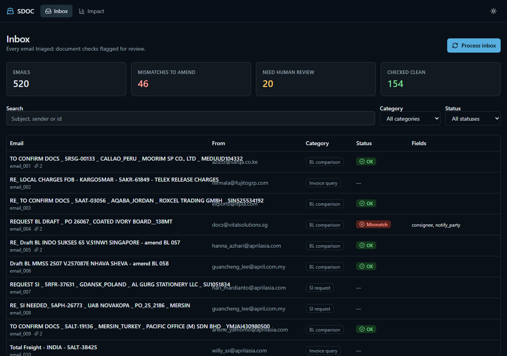
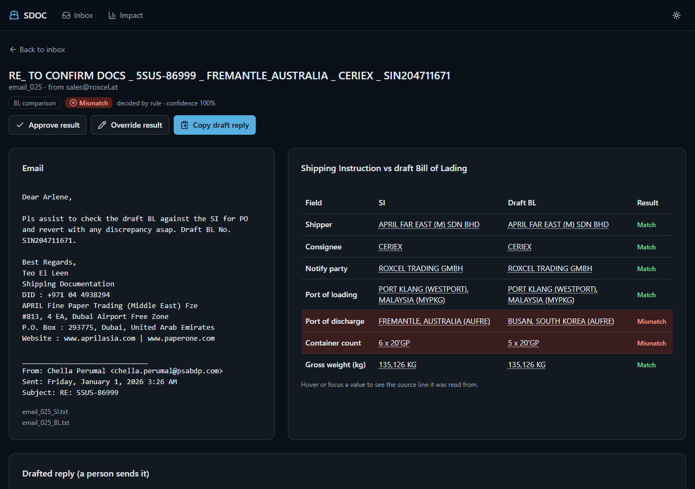

# SDOC — Shipping Document Check

Averis × Monash Hackathon 2026. An AI-assisted pipeline that triages a shipping-documentation inbox and checks every draft Bill of Lading (BL) against its Shipping Instruction (SI), escalating anything it cannot decide to a human with a reason.

**Current result on the 520-email dataset (rules + heuristics, no LLM calls):**

| Metric | Score |
|---|---|
| Final score (organisers' formula) | **1.000** |
| Classification macro-F1 (5 categories) | 1.000 |
| Defects fully caught end-to-end (exact fields) | 46 / 46 |
| False alarms (clean pair flagged as mismatch) | 0 |
| NEEDS_REVIEW escalation recall / precision | 20/20 · 20/20 |

Run `sdoc run` to reproduce. Tests: `pytest` (49 tests, ~2 s).

Docs: [docs/TODO.md](docs/TODO.md) (what's left) · [PLAN.md](PLAN.md) · [docs/ARCHITECTURE.md](docs/ARCHITECTURE.md) · [docs/HANDOFF.md](docs/HANDOFF.md) · [docs/COMPLIANCE.md](docs/COMPLIANCE.md) · [docs/pitch/](docs/pitch/) (deck + video script) · [web/README.md](web/README.md) (dashboard + Android)

## Quick start

```bash
py -3.12 -m venv .venv                # any Python 3.11+
.venv\Scripts\activate                # Windows   (source .venv/bin/activate on macOS/Linux)
pip install -e ".[dev]"
copy .env.example .env                # optional: add an LLM key later

sdoc run                              # -> output/submission.json + score vs ground truth
sdoc inspect email_025                # full detail for one email (evidence, comparisons, draft reply)
sdoc score output/submission.json --mistakes
sdoc serve                            # HTTP API on http://127.0.0.1:8000  (docs at /docs)
pytest
```

## What it does

```
email -> classify -> (BL_COMPARISON?) -> gate -> read SI + BL -> extract 7 fields -> compare -> OK / MISMATCH
            |                              |                                                     + defect_fields
            | rules first, LLM fallback    +-> NEEDS_REVIEW: missing_attachment | unreadable |   + draft reply
            v                                                wrong_doc_type | missing_value
      SI_REQUEST / INVOICE_QUERY / GENERAL / SPAM
```

- **AI reads, code decides.** Rules and label-synonym matching handle the regular cases for free; an LLM (Claude via Anthropic API or Amazon Bedrock) is a drop-in fallback for classification and for fields the heuristics miss. The comparison itself is deterministic and unit-tested, so it cannot hallucinate.
- **Never guesses.** A blank field, an image-only scan, a Commercial Invoice sent instead of a BL, or a dropped attachment becomes `NEEDS_REVIEW` with the reason, not a false mismatch.
- **Every decision carries evidence**: the source line for each extracted value, normalised forms, which rule or model decided, and a drafted amendment email for reviewers to send.

## Dashboard (web + Android)

```bash
sdoc serve                      # API
cd web && npm install && npm run dev      # dashboard at http://localhost:5173
```

Inbox, Compare (SI vs BL with evidence, approve/override, drafted reply) and Impact screens, plus Privacy / Terms / Cookies / Accessibility pages. The same build wraps into an Android APK with Capacitor: see [web/README.md](web/README.md).

## Repo layout

```
web/                  React dashboard + Capacitor Android project (web/android)
sdoc/                 the pipeline package (see docs/ARCHITECTURE.md)
  classify.py         Stage 1  rules -> LLM cascade
  readers.py          txt / pdf / docx / xlsx -> Document
  doctype.py          SI / BL / invoice / packing list / CoO by content
  extract.py          Stage 2  heuristic label matching -> LLM cascade
  compare.py          Stage 3  per-field normalisers + Comparator
  gate.py             NEEDS_REVIEW checks
  pipeline.py         orchestration, build_pipeline()
  evaluate.py         organisers' scoring formula + error analysis
  api.py              FastAPI for the dashboard
  cli.py              sdoc run | score | inspect | serve
tests/                pytest suite
Provided Information/ dataset and event documents (not in git except Participant Info)
output/               generated: submission.json, results_detail.json (gitignored)
```

## Enabling the LLM

Set in `.env`: `SDOC_LLM_PROVIDER=anthropic` + `ANTHROPIC_API_KEY`, or `SDOC_LLM_PROVIDER=bedrock` with AWS credentials. Replies are cached in `.cache/llm/` so reruns cost nothing. With Haiku 4.5 a full 520-email run is roughly US$1 even if every email hit the model; in practice the rules answer most of them first.

## Team

Frontend: reviewer dashboard (see `docs/HANDOFF.md`). Backend: cloud deployment of `sdoc.api` (AWS Lambda + DynamoDB per `PLAN.md`). Core pipeline: this package.

## Screenshots

| Inbox | Compare |
|---|---|
|  |  |
