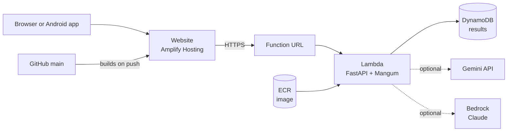

# Deploy on AWS

This is how the live demo runs. Everything is serverless, so an idle deployment costs almost nothing.



| Service | Role |
|---|---|
| **Lambda** (container image) | Runs the same FastAPI app as `sdoc serve`, wrapped by Mangum (`sdoc/lambda_handler.py`) |
| **Function URL** | The public address of the API |
| **DynamoDB** | Stores results, because Lambda runs several short-lived copies side by side |
| **ECR** | Holds the container image |
| **Amplify Hosting** | Builds and serves the website from GitHub |
| **Bedrock** (optional) | Claude models for the AI layer, with no API key |

Pick one region and use it for everything (the demo uses `ap-southeast-1`). Lambda cannot pull an image from another region's ECR. Bedrock can stay in a different region.

## Before you start

- An AWS account, and the AWS CLI configured with an **IAM user** (not the root user): `aws configure`, then `aws sts get-caller-identity` to check.
- Docker Desktop, running.
- Use PowerShell or a POSIX shell. The commands below use PowerShell variable syntax.

## 1. Create the DynamoDB table

```powershell
aws dynamodb create-table --table-name shipdoc-results `
  --attribute-definitions AttributeName=email_id,AttributeType=S `
  --key-schema AttributeName=email_id,KeyType=HASH `
  --billing-mode PAY_PER_REQUEST --region ap-southeast-1
```

## 2. Build and push the image

```powershell
$REGION = "ap-southeast-1"
$ACCOUNT = aws sts get-caller-identity --query Account --output text
$REG = "$ACCOUNT.dkr.ecr.$REGION.amazonaws.com"

docker buildx build --platform linux/amd64 --provenance=false --sbom=false -f Dockerfile.lambda -t shipdoc-api:lambda --load .
aws ecr create-repository --repository-name shipdoc-api --region $REGION
aws ecr get-login-password --region $REGION | docker login --username AWS --password-stdin $REG
docker tag shipdoc-api:lambda "$REG/shipdoc-api:v1"
docker push "$REG/shipdoc-api:v1"
```

`--provenance=false` matters: Lambda rejects the attestation manifest Docker adds by default.

## 3. Create the Lambda function

In the console: **Lambda → Create function → Container image**, pick the image, architecture **x86_64**. Then, under **Configuration**:

| Setting | Value |
|---|---|
| Memory | 1024 MB |
| Timeout | **2 min** (the default is 3 seconds and processing the inbox needs longer) |
| Environment variable | `SDOC_DYNAMODB_TABLE` = `shipdoc-results` |
| Function URL | Create, auth type **NONE**, leave CORS **off** (the app sends its own CORS headers; doing it twice breaks browsers) |

Add an inline policy to the function's role so it can use the table:

```json
{ "Version": "2012-10-17", "Statement": [ { "Effect": "Allow",
  "Action": ["dynamodb:GetItem", "dynamodb:PutItem", "dynamodb:Scan", "dynamodb:BatchWriteItem"],
  "Resource": "arn:aws:dynamodb:ap-southeast-1:<ACCOUNT_ID>:table/shipdoc-results" } ] }
```

## 4. Check it

```powershell
$API = "https://<id>.lambda-url.ap-southeast-1.on.aws"
Invoke-RestMethod "$API/health"
Invoke-RestMethod -Method Post "$API/process"      # processed : 520
Invoke-RestMethod "$API/health"                    # results   : 520
```

If `/process` fails, read the logs: `aws logs tail /aws/lambda/<function-name> --since 15m`.

## 5. Switch the AI on

Set these on the function (Configuration → Environment variables). Changing them takes effect within seconds and needs no rebuild.

| Provider | Variables |
|---|---|
| Gemini | `SDOC_LLM_PROVIDER=gemini`, `GEMINI_API_KEY=...` |
| Bedrock | `SDOC_LLM_PROVIDER=bedrock`, `SDOC_BEDROCK_REGION=us-east-1`, and `bedrock:InvokeModel` on the function's role |

Anthropic models on Bedrock need a one-time use-case form and a first test prompt in the Bedrock console. Check the bill after the first calls to see how the charge is classified and whether your credits cover it.

Then prove the AI is answering: `POST /translate/<email_id>` should return a real translation with an empty `note`. The `llm_provider` field in `/health` only echoes the setting.

## 6. Host the website on Amplify

Build the site with your API address baked in, then host it:

```powershell
cd web
$env:VITE_API_URL = "https://<id>.lambda-url.ap-southeast-1.on.aws"
npm ci ; npm run build
```

The simplest way to keep it updated is **Amplify → Host web app → GitHub**. Choose the repository and branch, tick **monorepo**, set the app root to `web`, and add `VITE_API_URL` under **Environment variables** (it is baked in at build time). Use this build spec:

```yaml
version: 1
applications:
  - appRoot: web
    frontend:
      phases:
        preBuild:
          commands:
            - npm ci
        build:
          commands:
            - npm run build
      artifacts:
        baseDirectory: dist
        files:
          - '**/*'
```

The app uses hash routes, so no redirect rules are needed.

## 7. Use your own domain

In **Amplify → Hosting → Custom domains → Add domain**, enter your domain. With DNS at a third party such as Cloudflare, Amplify shows records to add: a certificate validation CNAME plus a CNAME for each hostname. Add them all as **DNS only** (a grey cloud in Cloudflare), because proxying interferes with certificate validation. The status moves to **Available** in about 15 to 30 minutes. Keep the validation record in place so the certificate can renew.

A registered domain is a separate cost: AWS credits do not pay for domain registration.

## Updating the backend

GitHub is not connected to the Lambda: pushing code does not change it. Rebuild, push under a new tag, and point the function at it:

```powershell
docker tag shipdoc-api:lambda "$REG/shipdoc-api:v2"
docker push "$REG/shipdoc-api:v2"
aws lambda update-function-code --function-name <function-name> --image-uri "$REG/shipdoc-api:v2" --region $REGION
```

Use a new tag each time so you always know which version is live. Environment variables and DynamoDB data are untouched by a code update.

## Things that catch people

| Symptom | Cause and fix |
|---|---|
| `Internal Server Error` on `/process`, the log says `Task timed out` | The timeout is still the default (or the console put your 2 into the seconds box). Set 120 seconds |
| `{"Message":"Forbidden"}` from the Function URL | The public-access permission did not attach. The resource policy needs both `lambda:InvokeFunctionUrl` and `lambda:InvokeFunction`. Recreate the URL with auth NONE |
| A CORS error in the browser | CORS is switched on in the Function URL as well as in the app. Turn the Function URL's off |
| The image will not deploy ("media type not supported") | Rebuild with `--provenance=false` |
| The ECR repository or table seems to have vanished | The console is in another region. Check the region selector |
| The first request after a quiet period is slow | Lambda cold start, a few seconds. Warm it up with `/health` before a demo |
| The site loads but shows no data | `VITE_API_URL` was wrong or missing when it was built. Rebuild, or set the address from the gear icon |

## Limits of the current deployment

- The public deployment has **one shared workspace**. An uploaded email or an imported mailbox is held by a single Lambda instance and shown to every visitor, and can disappear when that instance is replaced. Treat it as a demo and use test data. Private per-visitor workspaces are on the [roadmap](/roadmap).
- The API has no authentication and open CORS. Restrict `allow_origins` in `sdoc/api.py` and add authentication before any real use.
- Image-only PDFs are escalated, not read with OCR.
