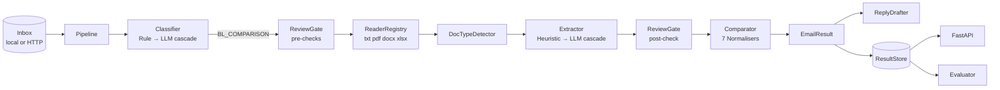

# Architecture

## Design principles

- **Single responsibility per stage.** Each stage is one class behind an abstract base (`Classifier`, `DocumentReader`, `Extractor`, `Normaliser`, `GateCheck`, `LLMClient`, `ResultStore`, `InboxRepository`). The `Pipeline` only orchestrates.
- **Dependency injection.** `build_pipeline()` wires defaults from `Settings`; tests inject fakes (a `FakeLLM`, a temp `JsonFileStore`).
- **Open for extension.** New file type → subclass `DocumentReader`, register it. New review check → subclass `GateCheck`, add to the list. New storage → implement `ResultStore`. New label spelling → one line in `LABEL_SYNONYMS`.
- **Cheap path first, AI second (cascade).** `CascadeClassifier` and `CascadeExtractor` call the LLM only when the deterministic step is not confident. The comparison never uses the LLM.
- **Fail safe, never silent.** Readers return `readable=False` instead of raising; the pipeline catches per-email exceptions and escalates rather than dropping the email.

## Components

| Component | File | Responsibility |
|---|---|---|
| `InboxRepository` | `inbox.py` | `LocalInbox` (bundle folder) and `HttpInbox` (organisers' server), same interface |
| `RuleClassifier` | `classify.py` | Weighted subject/body signals → category + confidence + signal list |
| `LLMClassifier` / `CascadeClassifier` | `classify.py` | LLM only when rule confidence < 0.5 |
| `ReaderRegistry` + readers | `readers.py` | Bytes → `Document(text, pairs, readable, error)`; PDF reader splits bold labels from regular values |
| `DocTypeDetector` | `doctype.py` | Content title rules first, filename suffix as fallback |
| `HeuristicExtractor` | `extract.py` | Label-synonym matching on (label, value) candidates; marks blanks (`???`, `TBA`, `____`) |
| `LLMExtractor` / `CascadeExtractor` | `extract.py` | JSON-schema extraction; fills only fields the heuristic missed |
| `Normaliser`s + `Comparator` | `compare.py` | Party / Port (name + UN/LOCODE) / Count / WeightKg; returns per-field evidence |
| `ReviewGate` | `gate.py` | Ordered checks: attachment → readable → doc type → (after extraction) values |
| `ReplyDrafter` | `drafts.py` | Amendment email for MISMATCH, resend request for NEEDS_REVIEW |
| `Evaluator` | `evaluate.py` | Organisers' formula: 0.30 macro-F1 + 0.20 defect-F1 + 0.50 end-to-end; `mistakes()` for error analysis |
| `ResultStore` | `store.py` | `InMemoryStore`, `JsonFileStore`; swap for DynamoDB in the cloud |
| API | `api.py` | Endpoints for the dashboard, including reviewer override |

## Decision flow for one BL_COMPARISON email

1. Fewer than 2 attachments? If the body expects documents ("attached", "compare the SI and BL", "still missing") → `missing_attachment`; if it is a request to *send* the draft → `OK`, nothing to compare.
2. Any attachment empty / corrupt / no text layer → `unreadable`.
3. Not exactly one SI and one BL by content → `wrong_doc_type`.
4. Extract 7 fields from each. Any field blank or not found → `missing_value`.
5. Compare. Differences → `MISMATCH` + `defect_fields`; none → `OK`.

## Scaling path

The pipeline is stateless per email, so it maps directly onto a queue + worker (SQS + Lambda). `Pipeline.run()` already processes emails in a thread pool; on AWS each message becomes one Lambda invocation writing to DynamoDB through a `ResultStore` implementation. LLM replies are cached by prompt hash so retries and reruns are free.

## Known limits / roadmap

- Image-only PDFs are escalated, not OCR'd. Adding OCR (Textract or Tesseract) is a `DocumentReader` change.
- Rules were tuned on this inbox's subject-line conventions; the LLM fallback covers other phrasings but has not been measured on real data.
- Party matching is exact after normalisation (legal suffixes tolerated). Fuzzy matching for typos would need a threshold agreed with Averis.
