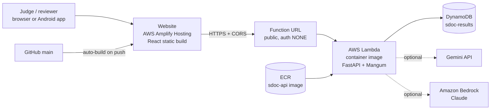

# SDOC on AWS: deployment log and team handover

**Project:** SDOC (Shipping Document Check), team *Claude's Plan*, Averis x Monash Hackathon 2026
**Written:** Sun 20 Sep 2026
**Deadline:** Tue 22 Sep, 12:00 PM. Aim to submit the form by 11:00.
**Workshop 2 (Averis):** Mon 21 Sep, 7 PM

This document records what was done to put SDOC on AWS, what exists now, how to change it, and what is still open. Read sections 1 to 3 first. The rest is reference.

---

## 1. Where we are right now

| Item | Status |
|---|---|
| Website live on AWS Amplify | Done. `https://main.d3pt38qur6i911.amplifyapp.com` |
| API live on AWS Lambda (public Function URL) | Done. URL: `https://j2mwf375qvy2xpf3xdqs4wai6y0rvrqd.lambda-url.ap-southeast-1.on.aws/` |
| API `/health` responds [IMPORTANT] | Done: `{"ok":true,"llm_provider":"none","results":0}` before processing |
| `POST /process` runs all 520 emails in the cloud | Done: returned `processed: 520` |
| Site shows the inbox with real statuses | Done: 520 emails, 45 mismatches, 21 need review, 154 clean |
| Results stored in DynamoDB | To verify: `/health` should say `results: 520`, and the table `sdoc-results` should have 520 rows |
| Cloud output identical to local `sdoc run` | **Open.** README says 46 mismatches / 20 escalated, the live site shows 45 / 21. See section 6 |
| AI switched on in the cloud (Gemini) | Not done yet |
| AI on Bedrock (Claude) | Not done yet (optional) |
| AWS code changes merged into `main` | To verify: changes were made on branch `aws-deploy` |
| Repo public, video, deck URLs, member names | Not done, see section 9 |

---

## 2. Architecture



Key points:

- **Same Python pipeline everywhere.** `sdoc.api:app` (FastAPI) is wrapped by Mangum (`sdoc/lambda_handler.py`), so Lambda runs the exact code we run locally.
- **AI reads, code decides.** The field comparison is plain tested code; the LLM is only used for classification fallback, extraction gaps and translation.
- **Region:** everything is in **ap-southeast-1 (Singapore)**. Bedrock, if used, is in **us-east-1** because the configured model IDs are `us.` inference profiles.
- **State lives in DynamoDB**, not on the Lambda, because Lambda runs several copies side by side and each copy has its own temporary disk.

---

## 3. AWS resources that exist

Console region must be **Asia Pacific (Singapore)** to see these. Most "my resource vanished" problems are the wrong region.

| Service | Name | Notes |
|---|---|---|
| ECR (registry) | `sdoc-api` | Holds the Lambda container image, tag `v1` |
| Lambda | `sdoc-api` | Container image, x86_64, **memory 1024 MB, timeout 120 s** |
| Lambda Function URL | (auto-generated) | Auth type **NONE** (public), **CORS left off** (the app handles CORS itself) |
| Lambda env var | `SDOC_DYNAMODB_TABLE=sdoc-results` | Switches the store from a local file to DynamoDB |
| IAM inline policy on the Lambda role | `sdoc-dynamodb` | `GetItem`, `PutItem`, `Scan`, `BatchWriteItem` on the `sdoc-results` table only |
| DynamoDB | `sdoc-results` | Partition key `email_id` (String), on-demand billing |
| Amplify Hosting | app connected to GitHub, branch `main` | Monorepo, app root `web`, env var `VITE_API_URL` = the Function URL |
| IAM user | `deployer` | Used by the AWS CLI. AdministratorAccess. Console sign-in enabled |
| Budget | monthly cost budget with email alert | $10 threshold |

Not created on purpose: EC2, RDS, NAT Gateway, OpenSearch (the usual surprise-bill services).

---

## 4. What we changed in the code

All changes were applied from `aws-deploy-changes.zip` (also available as `aws-deploy.patch`). Review with `git diff main..aws-deploy`.

| File | Change | Why |
|---|---|---|
| `sdoc/lambda_handler.py` (new) | `handler = Mangum(app, lifespan="off")` | Lambda entry point for the Function URL |
| `Dockerfile.lambda` (new) | Lambda base image, installs `.[aws]`, copies the dataset to `/var/task/data`, points writable paths to `/tmp` | Lambda's disk is read-only except `/tmp`, and the old cache `mkdir` would crash once an LLM provider is on |
| `sdoc/store.py` | Added `DynamoDBStore`, `count()`, and `make_store()` | Results must survive across Lambda instances. One item per email: `email_id`, `category`, `status`, `decided_by`, and `data` (full result as a JSON string, which avoids DynamoDB's float problem) |
| `sdoc/config.py` | New setting `dynamodb_table` (env `SDOC_DYNAMODB_TABLE`) | Chooses DynamoDB when set |
| `sdoc/api.py` | Uses `make_store`; `/health` uses `count()`; `/emails` does one scan instead of one lookup per email | Avoids 520 DynamoDB calls on every inbox load |
| `sdoc/llm.py` | Strong model (`claude-sonnet-5`) no longer sends assistant prefill or `temperature` | Claude Sonnet 5 answers HTTP 400 to both. The old code failed silently and skipped the strong-model retry |
| `pyproject.toml` | New `aws` extra (`boto3`, `mangum`); dev extra gains `moto` | Dependencies and tests |
| `.dockerignore` | Added `**/ground_truth.json` | Never ship the organisers' answer key inside an image |
| `tests/test_aws.py` (new) | DynamoDB store tests (against moto) and a Lambda Function URL event test | 5 new tests. Full suite passed in the authoring environment (58 passed, 1 skipped) |

**Not changed:** the pipeline itself (classify, read, extract, compare, gate). Scoring behaviour is untouched.

---

## 5. Problems we hit and how they were fixed

| Problem | Cause | Fix |
|---|---|---|
| `docker buildx build` failed: cannot connect to `docker_engine` | Docker Desktop was not running | Start Docker Desktop, wait for "Engine running" |
| ECR repository not visible in the console after `docker push` succeeded | Console was in the wrong region | Switch the region dropdown to Singapore |
| IAM user could not sign in to the console | Users created for CLI access have no console password | Enable console access under IAM, Users, deployer, Security credentials |
| `POST /process` returned "Internal Server Error" | Lambda **timeout was 2 seconds** (the console splits minutes and seconds; the 2 went into seconds). CloudWatch showed `Duration: 2000.00 ms, Status: timeout` | Set timeout to 120 s: `aws lambda update-function-configuration --function-name sdoc-api --timeout 120 --region ap-southeast-1` |

---

## 6. Open issue: 45 / 21 versus 46 / 20

The README claims 46 defective BLs caught and 20 escalations. The live site shows 45 mismatches and 21 needing review (66 in both cases), so one email is landing in a different bucket in the cloud.

Find it:

```powershell
curl.exe -s "$API/submission" -o cloud.json
$env:SDOC_LLM_PROVIDER="none"; sdoc run
python -c "import json; a=json.load(open('cloud.json')); b=json.load(open('output/submission.json')); print([k for k in a if a[k]!=b.get(k)])"
```

- Empty list: cloud and local agree; the difference is a local setting (for example a `.env` with Gemini on) and the README numbers just need a note.
- One or more ids: run `sdoc inspect <id>` and `Invoke-RestMethod "$API/results/<id>"` and compare `status` / `review_reason`. Likely cause is a PDF/DOCX library version differing between the local venv and the Linux image. Fix would be pinning versions in `pyproject.toml`, rebuilding as `v2`, and redeploying.

Do this before the deck states any headline number.

---

## 7. How to change things

### Frontend (website)
Push to `main`. Amplify rebuilds and redeploys automatically (a few minutes). A broken commit on `main` goes live, so try risky changes on a branch.

`VITE_API_URL` is baked in at build time. If it changes, update it in Amplify (App settings, Environment variables) and **Redeploy**.

### Backend (Lambda)
GitHub is **not** connected to the Lambda. Pushing code does not change it. To ship backend changes:

```powershell
$REGION="ap-southeast-1"; $ACCOUNT = aws sts get-caller-identity --query Account --output text
$REG="$ACCOUNT.dkr.ecr.$REGION.amazonaws.com"
aws ecr get-login-password --region $REGION | docker login --username AWS --password-stdin $REG
docker buildx build --platform linux/amd64 --provenance=false --sbom=false -f Dockerfile.lambda -t sdoc-api:lambda --load .
docker tag sdoc-api:lambda "$REG/sdoc-api:v2"; docker push "$REG/sdoc-api:v2"
aws lambda update-function-code --function-name sdoc-api --image-uri "$REG/sdoc-api:v2" --region $REGION
```

Use a new tag each time (`v3`, `v4`, ...) so it is obvious what is live. Docker Desktop must be running.

### Lambda settings (no rebuild needed)
Env vars, memory and timeout apply immediately from the Lambda console (Configuration tab).

### Read the logs
```powershell
aws logs tail /aws/lambda/sdoc-api --since 15m --region ap-southeast-1
```

### Re-run the inbox
```powershell
Invoke-RestMethod -Method Post "$API/process"
```
Results persist in DynamoDB across deploys. **Do not delete the table** before judging is over.

---

## 8. Configuration reference

| Env var (Lambda) | Value | Purpose |
|---|---|---|
| `SDOC_DYNAMODB_TABLE` | `sdoc-results` | Use DynamoDB for results |
| `SDOC_LLM_PROVIDER` | `none` now; `gemini` or `bedrock` later | Which AI backend to use |
| `GEMINI_API_KEY` | (secret) | Only for `gemini` |
| `SDOC_BEDROCK_REGION` | `us-east-1` | Only for `bedrock` |
| `SDOC_BEDROCK_FAST_MODEL` / `SDOC_BEDROCK_STRONG_MODEL` | (optional overrides) | Use if the inference profile IDs in `sdoc/config.py` are not the ones your account shows |
| `SDOC_DATA_DIR`, `SDOC_OUTPUT_DIR`, `SDOC_LLM_CACHE_DIR` | set in `Dockerfile.lambda` | Data is in the image; writable paths are under `/tmp` |

Amplify env var: `VITE_API_URL` = the Lambda Function URL, with `https://` and **no trailing slash**.

---

## 9. What is left (in priority order)

1. [ ] **Resolve the 45/21 vs 46/20 difference** (section 6).
2. [ ] **Confirm DynamoDB is really in use.** `/health` shows `results: 520`; the console table shows 520 items.
3. [ ] **Turn the AI on (Gemini).** Add `SDOC_LLM_PROVIDER=gemini` and `GEMINI_API_KEY` to the Lambda, then test:
   ```powershell
   Invoke-RestMethod -Method Post "$API/translate/email_001" -ContentType "application/json" -Body '{"target":"ms"}'
   ```
   Expect a translation and `llm_provider: gemini`. The rules require AI as a key component and the README currently says "no AI calls", so this needs visible evidence (translate demo, plus the LLM-path delta on the ~30 least-confident emails for a slide).
4. [ ] **Bedrock (optional).** In us-east-1: Bedrock, Model catalog, Claude Haiku 4.5, submit Anthropic's use-case form, send one Playground prompt. New free-tier accounts can be blocked at that form; do not depend on it.
5. [ ] **Merge `aws-deploy` into `main`** so judges see the Lambda code in the repo (Amplify will rebuild, which is harmless).
6. [ ] **Check git history before making the repo public** (both commands should print nothing):
   ```powershell
   git log --all --oneline -- "*ground_truth.json"
   git log --all --oneline -S"AIza"
   ```
   If either prints a commit, rewrite that history and rotate any exposed key first.
7. [ ] Fill member names and contact email in `web/src/content/business.ts`; fix `[Member` and `[URL]` placeholders in the deck.
8. [ ] APK: set the API URL in the app's gear menu, or rebuild with the public URL; upload to Drive.
9. [ ] Upload `docs/pitch/deck.pdf` to Drive (Anyone with link, Viewer).
10. [ ] Record the video (5:00 max). Hit `/health` about a minute before to warm the Lambda. Demo the deployed link, not localhost.
11. [ ] Make the repo public and verify the README setup from a clean clone.
12. [ ] Submit the Google Form: https://forms.gle/nnam5eXrf5cjXdf3

Ask at Workshop 2: which matters more to Averis, catching every defect or never raising a false alarm; whether to draft amendment emails or only flag; the scoring-server URL; which mail client their staff use.

---

## 10. Known limitations and risks

- **Upload .eml and Connect mailbox are per-instance.** That state lives in one Lambda copy's memory and `/tmp`, so an uploaded email can appear and then vanish on the next request. Persisting uploads in DynamoDB is roughly 40 lines of work. Mailbox credentials are deliberately memory-only, so demo mailbox connect locally, not on the public link.
- **Cold start.** The first request after a quiet period takes a few seconds (about 4.5 s init seen in the logs).
- **CORS is open (`*`).** Restricting it would break the Android app's origin, so leave it unless the APK is dropped.
- **The public API has no authentication.** Anyone with the link can call `/process` and the other endpoints. Emergency off switch: Lambda, Configuration, Function URL, Delete.
- **`/metrics` returns 404 in the cloud** (the answer key is deliberately not in the image), so the Impact page hides its live accuracy panel. Use the numbers from the local run on slides.
- **Answer key.** The 1.000 headline is scored against `ground_truth.json`, which our `.gitignore` describes as an organiser package sent by mistake, and the participant README says teams do not have it. As a team, decide how the claim is worded on the slides and whether to tell the organisers (Workshop 2 is a natural moment). Keep the file out of the repo and out of every image.
- **Bedrock model IDs** in `sdoc/config.py` (especially the Sonnet 5 one) were not verified against a live account.

---

## 11. Cost and account safety

- The account is on the **AWS Free plan**: $100 signup credit, up to $100 more from onboarding tasks, valid for 6 months or until credits run out. It closes rather than bills when credits are gone. **Never click "Upgrade plan"** unless the team agrees to pay.
- At this scale Lambda and DynamoDB sit inside their free allowances; ECR and Amplify cost cents. The only real exposure is Bedrock if enabled and the public URL is spammed.
- AWS has no hard spending cap. Budgets and credit-balance emails (50%, 25%, 10% remaining) are alerts only. Make sure the account email inbox is read by someone.
- **Rules for everyone:**
  - Never paste AWS access keys, the Gemini key or any secret into Discord, chat or a commit.
  - Do not use the root login for daily work. Ask for your own IAM user (IAM, Users, Create user, attach policy, enable console access).
  - Rotate the Gemini key and the 21st.dev key after the event (both passed through chat).
  - Do not create EC2, RDS, NAT Gateway or OpenSearch.
  - Keep everything in ap-southeast-1 (Bedrock in us-east-1 only).

---

## 12. Glossary (for teammates new to AWS)

| Term | Meaning here |
|---|---|
| **Region** | The AWS data-centre location. Resources only show in the region you are viewing |
| **ECR** | Storage for Docker images |
| **Lambda** | Runs our API code on demand, no server to manage |
| **Function URL** | A public web address for a Lambda |
| **DynamoDB** | Database that keeps the results |
| **Amplify Hosting** | Hosts the website and rebuilds it from GitHub |
| **IAM** | Users and permissions. The `Averis_deployer` user runs the CLI |
| **CloudWatch Logs** | Where Lambda writes its logs and errors |
| **Cold start** | The slow first request after the Lambda has been idle |
| **Bedrock** | AWS's service for calling models such as Claude |
